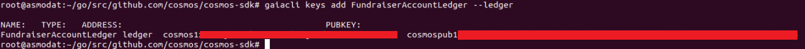

# Account Recovery & Delegators Guide


## Command Line + Ledger Nano S


## Introduction

This tutorial showcases secure key extraction from the [Cosmos Network](https://cosmos.network/) fundraiser seed and delegation using [Ledger Nano S](https://www.ledger.com/products/ledger-nano-s) hardware wallet and secure, open source software. If you choose to follow this tutorial make sure you run a clean machine with freshly installed Ubuntu 18.04 LTS operating system installed or follow or complete our "[Create Secure Environment Guide](https://github.com/cosmos-validators/Tutorials/blob/master/Secure-Environment.md#creating-secure-environment)". Another (but NOT recommended) option is to run a virtual machine using virtualization software such free [VirtualBox](https://www.virtualbox.org/) and installing Ubuntu as VM to add another security layer but it might not protect you against all kinds of malware that is potentially already hosted on your machine. For this reason you should always verify the address where your transaction is sent on the screen of your hardware wallet and should never trust what your computer screen is showing you.

_NOTE: If you choose to not follow [Creating Secure Environment Guide](https://github.com/cosmos-validators/Tutorials/blob/master/Secure-Environment.md#creating-secure-environment) and continue with your everyday "use" operating system we can't guarantee safety of your coins and some of the commands might cause breaking changes to your operating system. Remember that Antivirus / Antimalware software will never protect you against all threats and exploits that can reside on your everyday use Laptop or Personal Computer._


### Prerequisites


*   Completing [Creation of Secure Environment Guide](https://github.com/cosmos-validators/Tutorials/blob/master/Secure-Environment.md#creating-secure-environment) or clean installation of Ubuntu 18.04
*   Completing [Installation of Essential Toolkit](https://github.com/cosmos-validators/Tutorials/blob/master/Delegators-Guide/Essential-Toolkit.md#delegators-essential-toolkit-guide) on your Secure Environment 


### Steps To Complete


*   Ledger Nano S setup & app installation
*   Delegating your coins to validator of choice and querying account balance
*   Withdrawing your staking rewards & redelegation


## Ledger Nano S Guide

**WARNING**!!! (read before you proceed) If you want to recover your fundraiser secret using Ledger Nano S you will have to reset your device. If you already have funds secured by your ledger <span style="text-decoration:underline;">make absolutely sure that you have access to your current ledger recovery seed</span> **NOT just Cosmos Fundraiser Seed**. It's recommended that you should use new Ledger Nano S device for the Cosmos Seed Recovery ordered directly from the [manufacturer](https://www.ledger.com/). If you decide to proceed with this method and reset your ledger without having access to your current ledger recovery seed words or not tested that recovery with them works in the past (by for example [reinitializing your ledger device before using it](https://support.ledger.com/hc/en-us/articles/360005434914)) you are in very high risk of permanently losing all your funds currently secured by your ledger device!


### Account Recovery From Fundraiser Seed

Steps presented in this part of the tutorial (Account Recovery From Fundraiser Seed) can be completed on your everyday use PC/Laptop and do not require a Secure 


#### Prerequisites


*   Ledger Nano S with the supplied micro USB cable;
*   Computer (at least Windows 8 (64-bit), macOS 10.8, or Linux) with the internet;
*   The Ledger Live application [downloaded ](https://ledger.com/live)and installed.


#### Instructions

It is recommended to [start Ledger Live](https://support.ledgerwallet.com/hc/en-us/articles/360006395233) that guides you through the process described below.


##### Start restoration


1. Connect the Ledger Nano S to your computer using the micro USB/USB cable.
2. Press both buttons simultaneously as instructed on the device.
3. Press the left button located above the cancel icon when asked Configure as new device?
4. Press the right button located above the validation icon to select Restore a configuration?


##### Choose a PIN code

The length of the required PIN code varies:


*   Firmware version 1.3 or higher requires a PIN code between 4 and 8 digits long;
*   Firmware version 1.2 or lower requires a 4-digit PIN code.

WARNING!!! Always choose your own unique pin code, never enter a pin code supplied or suggested by someone.

To set your PIN code:


1. Press both buttons when Choose a PIN code is shown on the device.
2. Press the right or left button to choose the first digit of your PIN code.
3. Press both buttons to select the digit.
4. Repeat the process until all digits of your PIN code are selected.
5. Select the check icon (✓) and press both buttons to enter the PIN code.
6. Enter the PIN code again to confirm.


##### Enter recovery phrase

Before you proceed make sure that all your [cosmos network fundraiser](https://fundraiser.cosmos.network/) seed words are on the [BIP39 word list](https://github.com/bitcoin/bips/blob/master/bip-0039/english.txt), the order of the words is correct and that you did not made any typos as well as count the number of seed words which will be required to know for one of the following steps.


1. Press the right button to choose the length of your recovery phrase (12, 18 or 24 words). Press both buttons to enter.
2. Choose the first letter of Word #1 by pressing the right or left button. Press both buttons to select the letter.
3. Select the second letter of Word #1. Repeat until the device shows suggested words to choose from.
4. Choose Word #1 from the suggested words. Press both buttons to select it.
5. Repeat the process for each word of your cosmos network recovery seed phrase.
6. Your device is now ready is displayed if you've successfully entered your recovery phrase.


### 


### Cosmos Ledger Application Installation

In case of Ledger each network or blockchain such as Ethereum, Bitcoin, Cosmos has its own dedicated ledger application. In this step we will be installing Cosmos Network Ledger App using Ledger Live desktop client. This part of the tutorial requires Ubuntu 18.04 it's highly recommended that for yours and your files security you create a clean [Secure Environment](https://github.com/cosmos-validators/Tutorials/blob/master/Secure-Environment.md#creating-secure-environment) if you choose not follow this advice and use your everyday use OS you risk permanently corrupting it or losing your data.


#### Prerequisites


*   Ledger Nano S with the supplied micro USB cable
*   Ubuntu 18.04  Operating System or Completing [Creation of Secure Environment Guide](https://github.com/cosmos-validators/Tutorials/blob/master/Secure-Environment.md#creating-secure-environment).


#### Ledger Live Installation

Login to your account and enter terminal console by key combination of: **CTRL+ALT+T**

Install Ledger Live and create a console shortcut to it, by typing or copy pasting following commands into Terminal console and confirming them with **ENTER** key:


```
sudo -s
apt-get -y update && apt-get -y upgrade 

mkdir -p $HOME/ledger && cd $HOME/ledger && wget --user-agent="Mozilla/5.0 (X11; Fedora; Linux x86_64; rv:52.0) Gecko/20100101 Firefox/52.0" -O ledger-live https://download-live.ledger.com/releases/latest/download/linux

chmod +x $HOME/ledger/ledger-live && ln -s $HOME/ledger/ledger-live /usr/local/bin && ln -s $HOME/ledger/ledger-live /usr/bin
```


To launch the Ledger Live application all you have to do now is use already open or start a new console terminal with **CTRL+ALT+T** key combination and then type following command confirmed by **ENTER** key:


```
sudo ledger-live
```


When Ledgel Live application starts follow the setup wizard


1. Get Started
2. Use Initialized Device
3. Ledger Nano S
4. Checklist
*   Before you can select "Check now" option (In the step 3) connect your Ledger Nano S into the PC with the USB cable and enter your pin code.
*   Then in the Ledger Live client you click "Check now" button and will have to confirm "Allow Ledger Live manager ?" popup by selecting the check icon (✓) - pressing right button on your Ledger Nano S device.
5. Password lock
*   To prevent unauthorized access to transactions and account names It is recommended in this step to set a password for the Ledger Live application.
6. Bug & analytics
7. Open Ledger Live


##### Entering Developer Mode

In order to install Cosmos Ledger Application you need to enter a developer mode after accessing your Ledger Live Application.

Click a "Settings" - gear icon in the top right and then scroll to the bottom of the setting list and enable developer mode (switch should turn blue)


Navigate to "Manager" in the MENU on the left then type "COMOS" in the App catalog browser. After few seconds "COSMOS" application should pop up, once that happens click an "Install" button.


Once installation is complete you will find new app within your ledger nano device. To enter it you have to click both left and right button at the same time. 


## Delegators Guide using Ubuntu 18.04 LTS


### Account Creation

Once installation of [essential tools](https://github.com/cosmos-validators/Tutorials/blob/master/Delegators-Guide/Essential-Toolkit.md#delegators-essential-toolkit-guide) and Cosmos Ledger Application is completed you can proceed to create new "account" using gaiacli that will later be used to delegate your coins. For the tutorial purposes we will call your new account "**FundraiserAccountLedger**" but it can be any word that will help you recognize it origin.

Before you proceed you must make sure your Ledger Nano S device is connected to your PC with the USB cable and that you entered Cosmos Ledger Application otherwise following command will fail with the "ERROR: ledger nano S: are you sure the Cosmos app is open?"


Login to your account and enter terminal console by key combination of: **CTRL+ALT+T**

Create your account, by typing or copy pasting following commands into Terminal console and confirming them with **ENTER** key:


```
sudo -s
gaiacli keys add FundraiserAccountLedger --ledger
```


Result of the command should output NAME, TYPE,  ADDRESS and PUBKEY separated by whitespaces. 




The "ADDRESS" aka [Cosmos Account Number](https://github.com/cosmos/cosmos-sdk/blob/7f789d2ed342de18f4443ae434f3e43f790f1854/docs/spec/addresses/bech32.md) is a **public** string with a human-readable prefix (e.g. **cosmos1**xxxxxxxxxxxxxxxxxxxxxxxxxxxxxxxxxxxxxx) that identifies your account. When someone wants to send you funds you can provide them with that address. 


### Connecting to Cosmos Seed Node


```
gaiacli config trust-node false
gaiacli config chain-id cosmoshub-1
gaiacli config node https://nodes.cosmos-validators.com:443
```


To check current block height run:


```
gaiacli status | jq -r '.sync_info.latest_block_height'
```


To query your account balance execute:


```
gaiacli query account cosmos1xxxxxxxxxxxxxxxxxxxxxxxxxxxxxxxxxxxxxx
```


_NOTE: Your balance is displayed in uatom aka "Mico Atoms" NOT ATOMs so be carefull, delegation will also have to be defined in uatoms. `1` ATOM == `1'000'000` uatom's so you have to remember to add 6 more zeroes to the value you want to delegate._

If you typed something wrong and you see error saying configuration is invalid or that there are issues with "toml" file, you can edit it by typing:


```
nano $HOME/.gaiacli/config/config.toml
```


Content should resemble following screenshot 


_NOTE: When using nano editor in order to save changes press combination of keys: **CTRL+O**, **[ENTER]**, **CTRL+X**_


### Delegating ATOMs to Your Validator of choice

For the purpose of this tutorial we will use [Bity.com Cosmos Validator](https://bity.com/products/crypto-staking-services/) public address that is

**cosmosvaloper1uv26ytrnmydyctq0s58ve2k6wn2p653mqs80fm**

_NOTE: This tutorial will work regardless of the validator public address you choose, please ensure good practices and due diligence when selecting validators to delegate your coins._

Before you can delegate you have to specify **<amountToBond>**. this amount is "the amount you want to delegate" **defined in micro atoms** (`10^-6` atoms or `1'000'000` uatoms per `1` ATOM). 

If you wish to for example delegate `123` ATOMS you have to set this amount to `123000000uatom` (<span style="text-decoration:underline;">suffix with `6` zeros and 'uatom' sting without white spaces</span>)


```
gaiacli tx staking delegate cosmosvaloper1uv26ytrnmydyctq0s58ve2k6wn2p653mqs80fm <amountToBond>uatom --from FundraiserAccountLedger --fees=50000uatom
```


Once you enter this command make sure that your Ledger Nano S device is connected to your PC and that you navigate to and enter Cosmos App before executing it.


### Collecting Delegation Rewards

After certain period of time your account will accumulate rewards proportional to your stake and inflation of ATOM coins, in order to have your coins credited to your account you will have to send a "withdraw" transaction.

NOTE: If coins you earn are not withdrawn and then re-delegated they will not be earning you rewards so it's a good practice to once every while withdraw the rewards and redelegate for them to earn you more interest.


```
gaiacli tx distr withdraw-all-rewards --from FundraiserAccountLedger --fees=50000uatom
```


Wait few seconds after confirming your transaction and retyping account password, then you can use following command to verify change on your account balance:


```
gaiacli query account  cosmos1xxxxxxxxxxxxxxxxxxxxxxxxxxxxxxxxxxxxxx
```

