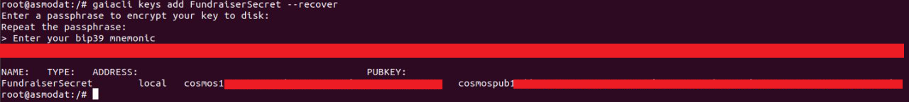
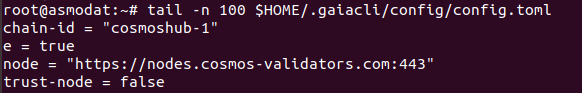

# Account Recovery & Delegators Guide


## Command Line Only


## Introduction

This tutorial showcases secure key extraction from the [Cosmos Network](https://cosmos.network/) fundraiser seed and delegation using basic tools and secure, open source software. It's however advised to use Ledger Wallet and follow our tutorial [how to delegate using a Hardware Wallet](https://github.com/cosmos-validators/Tutorials/blob/master/Secure-Environment.md#creating-secure-environment). If you choose to follow this tutorial make sure you run a clean machine with freshly installed Ubuntu 18.04 LTS operating system installed or follow or complete our "[Create Secure Environment Guide](https://github.com/cosmos-validators/Tutorials/blob/master/Secure-Environment.md#creating-secure-environment)". Another (but NOT recommended) option is to run a virtual machine using virtualization software such free [VirtualBox](https://www.virtualbox.org/) and installing Ubuntu as VM to add another security layer but it will not protect you against malware that is potentially already hosted on machine such as keyloggers when you will be retyping your fundraiser seed.

_NOTE: If you choose to not follow [Creating Secure Environment Guide](https://github.com/cosmos-validators/Tutorials/blob/master/Secure-Environment.md#creating-secure-environment) and continue with your everyday "use" operating system we can't guarantee safety of your coins and some of the commands might cause breaking changes to your operating system. Remember that Antivirus / Antimalware software will never protect you against all threats and exploits that can reside on your everyday use Laptop or Personal Computer._


### Prerequisites


*   Completing [Creation of Secure Environment Guide](https://github.com/cosmos-validators/Tutorials/blob/master/Secure-Environment.md#creating-secure-environment) or clean installation of Ubuntu 18.04
*   Completing [Installation of Essential Toolkit](https://github.com/cosmos-validators/Tutorials/blob/master/Secure-Environment.md#creating-secure-environment) on your Secure Environment 


### Steps To Complete


*   Delegating your coins to validator of choice and querying account balance
*   Withdrawing your staking rewards & redelegation


## Delegators Guide using Ubuntu 18.04 LTS


### Account Recovery From Fundraiser Seed

Once installation of essential tools is completed you can proceed to restore your account using fundraiser seed words by adding/creating new encrypted key used to sign transactions. For the tutorial purposes we will call it "**FundraiserSecret**" but it can be any word that will help you to recognize your key name.


```
gaiacli keys add FundraiserSecret --recover
```


You will be prompted to enter the password that will be used to encrypt your seed words then once you confirm it by retyping you will be prompted to enter your 12 or 24 fundraiser seed words. Final result should resemble following screenshot:

_NOTE: Do NOT lose password you enter before you enter your seed words, it will be required later to send your transaction and unencrypt your 'FundraiserSecret' by gaiacli, if you forget or lose it you will have to recover your account again by using 'gaiacli keys add' command._




The "ADDRESS" aka [Cosmos Account Number](https://github.com/cosmos/cosmos-sdk/blob/7f789d2ed342de18f4443ae434f3e43f790f1854/docs/spec/addresses/bech32.md) is a **public** string with a human-readable prefix (e.g. **cosmos1**xxxxxxxxxxxxxxxxxxxxxxxxxxxxxxxxxxxxxx) that identifies your account. When someone wants to send you funds you can provide them with that address. 


### Connecting to Cosmos Seed Node


```
gaiacli config trust-node false
gaiacli config chain-id cosmoshub-1
gaiacli config node https://nodes.cosmos-validators.com:443
```


To check current block height run:


```
gaiacli status | jq -r '.sync_info.latest_block_height'
```


To query your account balance execute:


```
gaiacli query account cosmos1xxxxxxxxxxxxxxxxxxxxxxxxxxxxxxxxxxxxxx
```


_NOTE: Your balance is displayed in uatom aka "Mico Atoms" NOT ATOMs so be carefull, delegation will also have to be defined in uatoms. 1 ATOM == 1'000'000 uatom's so you have to remember to add 6 more zeroes to the value you want to delegate._

If you typed something wrong and you see error saying configuration is invalid or that there are issues with "toml" file, you can edit it by typing:


```
nano $HOME/.gaiacli/config/config.toml
```


Content should resemble following screenshot 





_NOTE: When using nano editor in order to save changes press combination of keys: CTRL+O, [ENTER], CTRL+X_


### Delegating ATOMs to Your Validator of choice

For the purpose of this tutorial we will use [Bity.com Cosmos Validator](https://bity.com/products/crypto-staking-services/) public address that is

**cosmosvaloper1uv26ytrnmydyctq0s58ve2k6wn2p653mqs80fm**

_NOTE: This tutorial will work regardless of the validator public address you choose, please ensure good practices and due diligence when selecting validators to delegate your coins._

Before you can delegate you have to specify **<amountToBond>**. this amount is "the amount you want to delegate" **defined in micro atoms** (10^-6 atoms or `1000000` uatoms per `1` ATOM). 

If you wish to for example delegate `123` ATOMS you have to set this amount to `123000000uatom` (<span style="text-decoration:underline;">suffix with 6 zeros and 'uatom' sting without white spaces</span>)


```
gaiacli tx staking delegate cosmosvaloper1uv26ytrnmydyctq0s58ve2k6wn2p653mqs80fm <amountToBond>uatom --from FundraiserSecret --fees=50000uatom
```


Once you enter this command you will be prompted to type Y to confirm it's correctness and then type the password you used while recovering your key with 'gaiacli keys add' command to encrypt your FundraiserSecret.


### Collecting Delegation Rewards

After certain period of time your account will accumulate rewards proportional to your stake and inflation of ATOM coins, in order to have your coins credited to your account you will have to send a "withdraw" transaction.

NOTE: If coins you earn are not withdrawn and then re-delegated they will not be earning you rewards so it's a good practice to once every while withdraw the rewards and redelegate for them to earn you more interest.


```
gaiacli tx distr withdraw-all-rewards --from FundraiserSecret --fees=50000uatom
```


Wait few seconds after confirming your transaction and retyping account password, then you can use following command to verify change on your account balance:


```
gaiacli query account  cosmos1xxxxxxxxxxxxxxxxxxxxxxxxxxxxxxxxxxxxxx
```


